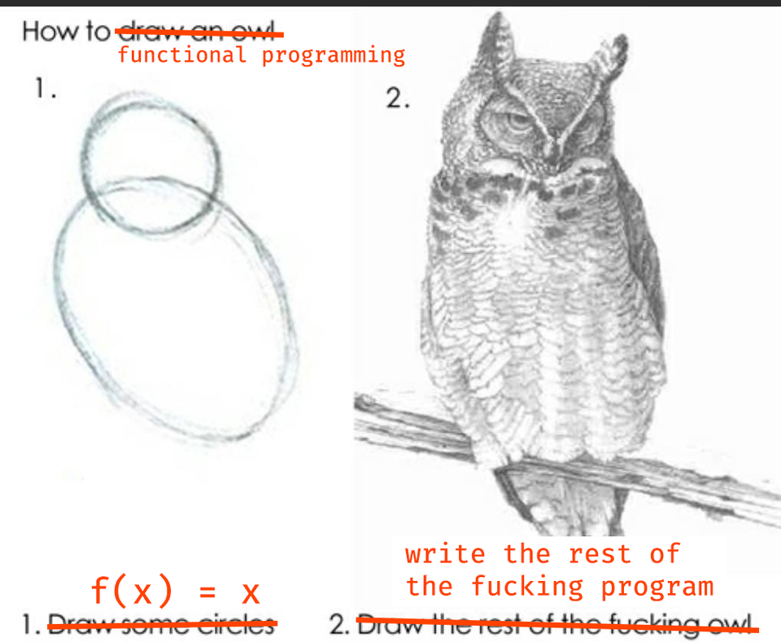
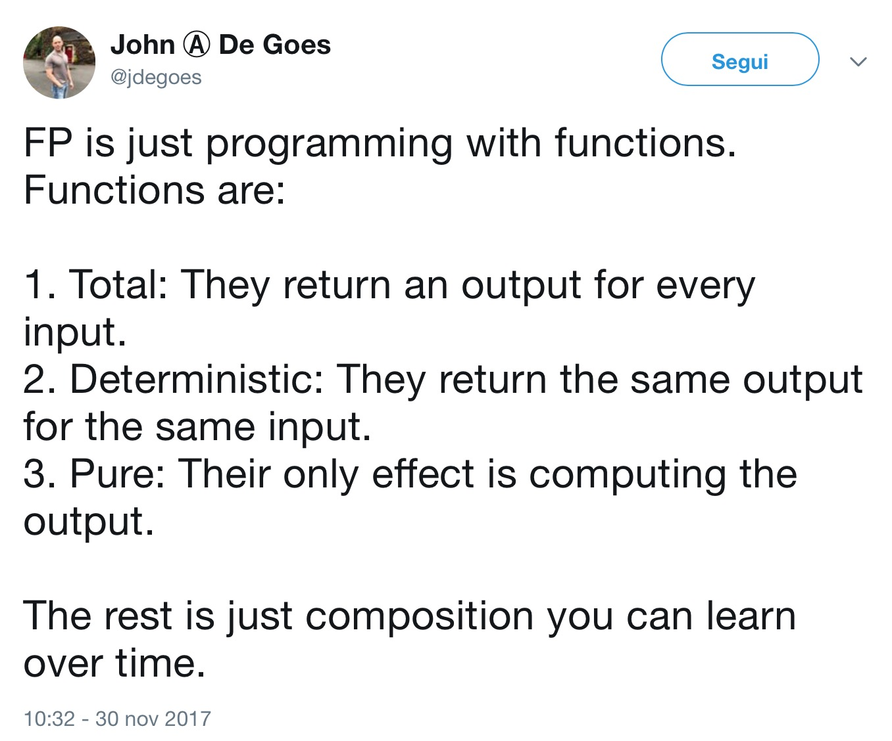
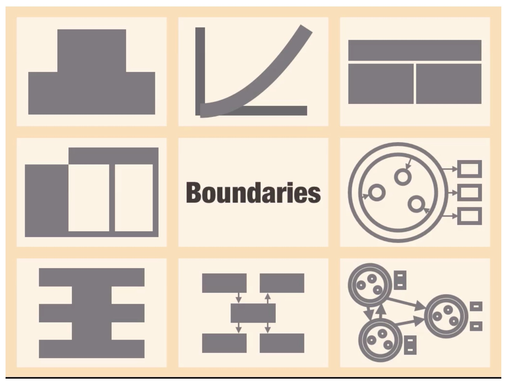

theme: Next, 8
build-lists: true
autoscale: true

# Advanced Swift Optics


[.footer: https://www.njimedia.com/get-noticed-2/camera-lens/]

---

## Today's menu

- Functional Programming
	- The value of data structures
- Functional Optics
	- Sane data manipulation
- Lots of code

^
- code in repository
- link at end of talk

---

## Functional Programming

---



[.footer: https://www.reddit.com/r/ProgrammerHumor/comments/6d3eqh/functional_programming_for_beginners/]

^
- one of those things that, if you do it you know what it is, if you don't remains obscure, or if you're like me, they're obscure even if you do it

---



[.footer: https://twitter.com/jdegoes/status/936301872066977792]

^
- different communities have different interpretations and techniques, but the basics are the same: pure functions as much as possible

---

## Gary Bernhardt - "Boundaries" (2012)



[.footer: https://www.destroyallsoftware.com/talks/boundaries]

^
- move everything that's not pure and functional to the outer shell, connected to the outside world
- create a number of those shells where the outside boundary makes the connections and the interior is where the business logic happens

---

## Pure Functions

- they can only transform data
- input: one of more instances of some types
- output: the same
- the data involved is as important as the functions themselves

---

> Show me your flowcharts and conceal your tables, and I shall continue to be mystified. Show me your tables, and I won’t usually need your flowcharts; they’ll be obvious.
<br>
> Fred Brooks, The Mythical Man-Month

^
- flowcharts: logic
- tables: data
- appropriate types and data structures are key to functional programming

---

## Immutable Data Structures

- value types
- `struct`, `enum`
- domain modeling
- UI modeling
- transitional information
- intent representation

^
- immutable means that, if I pass around a pointer to a section of memory, the contents of that section must not change over time
- information is immutable by definition: only new information is generated when some is obsoleted
- values types are intrinsically immutable
- copy semantics
- a great Swift feature

---

```swift
func triggerAction(
    data: ActionData,
    listener: ListenerType)
{
    /// depending on the current state, the data value
    /// and some rules, call methods on the listener
}
```

---

```swift
func triggerAction(
    data: ActionData,
    listener: ListenerType)
{
    /// depending on the current state, the data value
    /// and some rules, call methods on the listener
}

enum ActionResult {
    case doThis(value: Int)
    case doThat(value: String)
}

func triggerAction(data: ActionData) -> ActionResult {
    /// depending on the current state, the data value
    /// and some rules, return a specific ActionResult
}
```

^
don't anticipate separation of concerns

---

```swift
extension Int {
    var isPositive: Bool {
        get {
            return self >= 0
        }
        set(shouldBePositive) {
            if isPositive != shouldBePositive {
                self = -self
            }
        }
    }
}
```

^
- transform logic into data
- isPositive become a integral property of the Int type

---

## Data structures bring us joy...

- separation of _representation_ from _interpretation_
- the former at the core, the latter at the boundary
- readable, testable, maintainable
- not just for functional programming

---

## ...and pain

- they can get messy and complex
- lots of nesting
- we usually operate on tiny parts...
- ...but we need to transform the whole

^
- expose complexity

---

## Optics

- types (usually structs)
- encapsulate various kinds of relationships between data structures
- for example, "focusing":
	- relationship between a data structure and one of its parts
- see data from a different point of view

---

## A note on naming

- different sources and different platforms use different names
- "Profunctor Optics - Modular Data Accessors" by Matthew Pickering, Jeremy Gibbons, and Nicolas Wu
- "Don't Fear the Profunctor Optics!" GitHub repo

[.footer: http://www.cs.ox.ac.uk/people/jeremy.gibbons/publications/poptics.pdf | https://github.com/hablapps/DontFearTheProfunctorOptics]

---

## Optic<Root, Value>

- like `KeyPath` (not a coincidence)
- simplified representation
- full representations has 2 more parameters:
	- generic change on both `Root` and `Value`

---

## Lens

```swift
struct Lens<Root, Value> {
    let view: (Root) -> Value
    let update: (Value, Root) -> Root
}
```

^
- an encapsulated accessor

---

```swift
func makeLens<Root, Value>(
    _ wkp: WritableKeyPath<Root, Value>)
    -> Lens<Root, Value>
{
    return Lens<Root, Value>(
        view: { root in 
            root[keyPath: wkp]
        },
        update: { newValue, root in
            var m_root = root
            m_root[keyPath: wkp] = newValue
            return m_root
    })
}
```

^
- can be done in other ways (for immutable classes or structs)

---

```swift
extension Lens {
    func modify (
        _ transformValue: @escaping (Value) -> Value)
        -> (Root) -> Root
    {
        return { root in
            self.update(
                transformValue(self.view(root)),
                root)
        }
    }
}
```

^
a transformation of the part yields a transformation of the whole

---

```swift
struct LoginPage {
    var username: String
    var password: String
    var isRememberMeActive: Bool
    var isLoginButtonActive: Bool
}
```

---

```swift
extension LoginPage {
    static func lens<Value>(
        _ wkp: WritableKeyPath<LoginPage, Value>)
        -> Lens<LoginPage, Value>
    {
        return makeLens(wkp)
    }
}

let passwordLens = LoginPage.lens(\.password)

/// trimPassword: (LoginPage) -> LoginPage
let trimPassword = passwordLens.modify {
    $0.trimmingCharacters(
        in: CharacterSet(charactersIn: " "))
}
```

^
- scoped KeyPath
- in general, we can enclose optics in the appropriate namespace

---

```swift
func zip<Root, Value1, Value2>(
    _ lens1: Lens<Root, Value1>,
    _ lens2: Lens<Root, Value2>)
    -> Lens<Root, (Value1, Value2)> 
{
    return Lens<Root, (Value1, Value2)>(
        view: { root in
            (lens1.view(root), lens2.view(root))
    },
        update: { tuple, root in
            lens2.update(
                tuple.1,
                lens1.update(
                    tuple.0,
                    root))
    })
}
```

^
- with any number of lenses

---

```swift
struct Application {
    var loginPage: LoginPage
    var userSession: UserSession
}

struct UserSession {
    var token: String?
    var currentUsername: String?
}
```

^
- LoginPage as a part of a bigger model

---

```swift
/// storedUsernameLens:
/// Lens<Application, (String?, String, Bool)>
let storedUsernameLens = zip(
    Application.lens(\.userSession.currentUsername),
    Application.lens(\.loginPage.username),
    Application.lens(\.loginPage.isRememberMeActive)
)

/// restoreUsername: (Application) -> Application
let restoreUsername = storedUsernameLens.modify {
    current, _, rememberMe in
    guard let current = current, rememberMe else {
        return (nil, "", rememberMe)
    }
    
    return (current, current, rememberMe)
}
```

---

```swift
extension Dictionary {
    static func lens(
        at key: Key)
        -> Lens<Dictionary, Value?>
    {
        return Lens<Dictionary, Value?>(
            view: { $0[key] },
            update: { value, root in
                var m_root = root
                m_root[key] = value
                return m_root
        })
    }
}
```

^
- a pretty useful lens
- notice the optional value
- we'll see an example later on

---

## Prism

```swift
struct Prism<Root, Value> {
    let match: (Root) -> Value?
    let build: (Value) -> Root
}
```

^
- Lens for struct, Prism for enum

---

```swift
enum LoginState {
    case idle
    case processing(attempt: Int)
    case failed(error: Error)
    case success(message: String)
}
```

^
- no paths and no code generation, unfortunately
- many ways to add prisms

---

```swift
extension LoginState {
    typealias prism<Value> = Prism<LoginState, Value>
}

extension Prism where Root == LoginState, Value == String {
    static var success: LoginState.prism<String> {
        return .init(
            match: {
                switch $0 {
                case .success(let message):
                    return message
                default:
                    return nil
                }
        },
            build: { .success(message: $0) })
    }
}
```

^
- LoginState.prism is the "prism factory" for LoginState

---

```swift
let currentState = LoginState.idle /// any state
let successPrism = LoginState.prism.success

/// successMessage: String?
let successMessage = successPrism.match(currentState)
```

^
this match is not something available in swift

---

```swift
extension Prism {
    func tryModify (
        _ transformValue: @escaping (Value) -> Value)
        -> (Root) -> Root
    {
        return { root in
            guard let matched = self.match(root) else {
                return root
            }
            return self.build(transformValue(matched))
        }
    }
}
```

^
- valid for any generic prism
- we don't care about root

---

```swift
let processingPrism = LoginState.prism.processing

/// incrementAttemptsIfPossible: (LoginState) -> LoginState
let incrementAttemptsIfPossible = processingPrism
    .tryModify { $0 + 1 }
```

---

```swift
enum Event {
    case application(Application)
    case login(Login)
        
    enum Login {
        case tryLogin(outcome: LoginOutcome)
        case logout(motivation: LogoutMotivation)
        
        enum LoginOutcome {
            case success
            case failure(message: String)
        }        
    }
}
```

^
- we register an event, and if it's a login failure, we want to operate on the message
- nested enums, we need composition

---

```swift
/// Prism<A, B> + Prism<B, C> = Prism<A, C>

func pipe<A, B, C>(
    _ prism1: Prism<A, B>,
    _ prism2: Prism<B, C>)
    -> Prism<A, C>
{
    return Prism<A, C>(
        match: {
            prism1.match($0).flatMap(prism2.match)
        },
        build: {
            prism1.build(prism2.build($0))
        })
}
```

^
- even more than 2
- pipe is easier to use and manipulate

---

```swift
extension Prism where Value == Event.Login {
    var tryLogin: Prism<Root, Event.Login.LoginOutcome> {
        return pipe(self, .tryLogin)
    }
}

extension Prism where Value == Event.Login.LoginOutcome {
    var failure: Prism<Root, String> {
        return pipe(self, .failure)
    }
}
```

^
- better, clearer composition, that resembles KeyPaths
- assuming that we defined the appropriate prisms for all types

---

```swift
/// failureMessagePrism: Prism<Event, String>
let failureMessagePrism = Event.prism
    .login.tryLogin.failure

/// uppercasedMessageIfPossible: (Event) -> Event
let uppercasedMessageIfPossible = failureMessagePrism
    .tryModify { $0.uppercased() }
```

^
- composition looks like KeyPath
- exploring the stack, the rebuilding it from scratch

---

## Affine

```swift
struct Affine<Root, Value> {
    let preview: (Root) -> Value?
    let tryUpdate: (Value, Root) -> Root?
}
```

^
- between Lens and Prism
- preview and tryUpdate are failable

---

```swift
extension Array {    
    static func affineForFirst(
        where predicate: @escaping (Element) -> Bool)
        -> Affine<Array, Element>
    {
        return Affine<Array, Element>(
            preview: { array in
                array.first(where: predicate)
        },
            tryUpdate: { element, array in
                guard let index = array
                    .index(where: predicate) 
                    else { return nil }
                
                var m_array = array
                m_array.remove(at: index)
                m_array.insert(element, at: index)
                return m_array
        })
    }
}
```

^
- updates the first if it exists
- also affine at index

---

## Affine generalizes both Lens and Prism

- `Lens` -> `Affine`
- `Prism` -> `Affine`
- `pipe` on `Affine`
- `Lens` + `Prism` = `Affine`

^
- I can write pipe versions that take lens, prism and affine independently
- more code in the repository

---

```swift
enum TransactionState {
    case idle
    case failure(String)
    case success([String: TransactionResult])
}

struct TransactionResult {
    var completion: Date
    var outcomes: [TransactionOutcome]
}

struct TransactionOutcome {
    var user: String
    var balance: Double
}
```

^
- complex example
- lots of nesting, of different kind

---

```swift
let ultimateAffine = pipe(
    
    TransactionState.prism.success,
    
    Dictionary.lens(at: "IllRememberThis"),
    
    Optional.prism,
    
    TransactionResult.lens(\.outcomes),
    
    Array.affineForFirst {
        $0.user == "Siri McSirison"
    },
    
    TransactionOutcome.lens(\.balance)
)
```

---

## Recap

- Functional Programming rocks
	- even if just a bit
- Well-defined data structures are the key to clear, testable and maintainable code
- Optics: a useful tool to operate on data structures in a generic way
	- Lens: structs and classes
	- Prisms: enums
	- Affine: optional access

---

# Thank You

@_logicist

https://github.com/broomburgo/AdvancedSwiftOptics